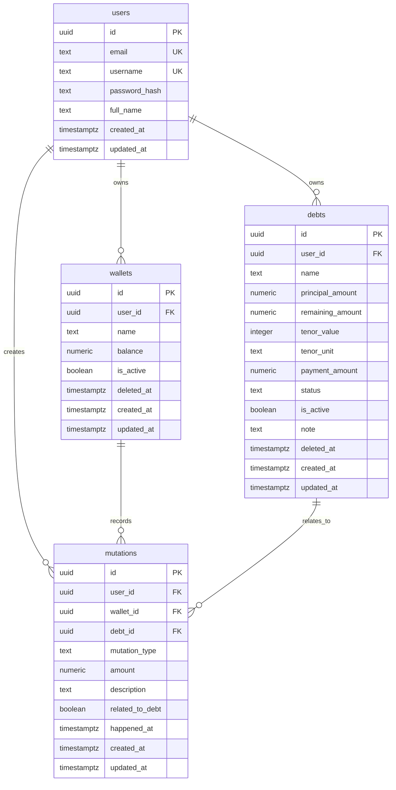

# Phase 1 Schema Design

This document completes the domain and schema design baseline for Phase 1.

## ERD

## Design Notes

- `users` is the ownership root for all MVP financial data.
- `wallets` is master data and keeps the current stored balance.
- `debts` is master data and keeps the stored remaining amount.
- `mutations` is the event table that changes wallet and debt state.
- `debt_id` on `mutations` is optional and only valid when `related_to_debt = true`.

## Soft Delete Strategy

Soft delete is used only where the product rules say history must remain intact while records may be hidden from active usage.

Tables using `deleted_at`:

- `wallets`
- `debts`

Tables not using `deleted_at` in MVP:

- `mutations`
  because mutation deletion is not allowed
- `users`
  because user lifecycle is out of MVP scope

## Important Constraints

- `wallets.balance >= 0`
- `debts.principal_amount > 0`
- `debts.remaining_amount >= 0`
- `mutations.amount > 0`
- `mutations.mutation_type IN ('masuk', 'keluar')`
- `debts.status IN ('active', 'lunas', 'inactive')`
- `mutations.related_to_debt = true` requires `debt_id`
- all financial tables are scoped by `user_id`

## Query Direction

Expected user-scoped queries are optimized by indexes on:

- wallet activity filters
- debt status filters
- mutation history by user
- mutation history by wallet
- mutation history by debt
